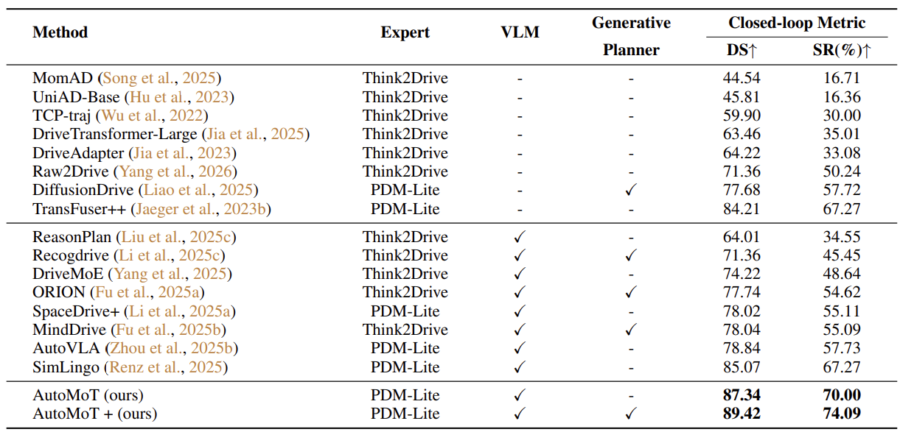

# [ICML'26] AutoMoT: A Unified Vision-Language-Action Model with Asynchronous Mixture-of-Transformers for End-to-End Autonomous Driving

<p align="center">
  <a href="https://icml.cc/">
    
  </a>
</p>

<p align="center">
  <a href="https://arxiv.org/abs/2603.14851"></a>
  &nbsp;
  <a href="https://automot-website.github.io/"></a>
  &nbsp;
  <a href="https://huggingface.co/Oscar-Huang/AutoMoT"></a>
  &nbsp;
  <a href="https://huggingface.co/datasets/Oscar-Huang/NuSync"></a>
</p>

https://github.com/user-attachments/assets/dcd08673-5ea5-49a1-8dca-5d4b4b8d91fa

**[ICML'26] This is the official repository of AutoMoT, an asynchronous VLA as E2E Model.**

> **Current release**: Closed-loop inference on Bench2Drive (220 routes), model checkpoints, NuSync dataset, and PDM-Lite AutoMoT training code.

---

## TODO

- [x] Bench2Drive closed-loop inference (220 routes, CARLA 0.9.15)
- [x] Model checkpoint release ([HuggingFace](https://huggingface.co/Oscar-Huang/AutoMoT))
- [x] NuSync dataset release ([HuggingFace](https://huggingface.co/datasets/Oscar-Huang/NuSync))
- [x] PDM-Lite AutoMoT training code
- [ ] Release the Action Refiner

---

## Table of Contents

1. [Method Overview](#method-overview)
2. [Repository Structure](#repository-structure)
3. [Environment Setup](#environment-setup)
4. [Model Weights](#model-weights)
5. [Running Evaluation](#running-evaluation)
6. [Training](#training)
7. [Benchmark Results](#benchmark-results)
8. [Citation](#citation)

---

## Method Overview <a name="method-overview"></a>

AutoMoT uses an **Asynchronous Mixture-of-Transformers** design: a slow Understanding Expert (4B) performs low-frequency reasoning, while a fast Action Expert (1.6B) runs at high frequency to decode 3-second decisions and spatial-temporal waypoints via KV-cache bridging.

---

## Repository Structure <a name="repository-structure"></a>

The repository can be cloned as `AutoMoT`, `automot`, or any other directory name. All commands below use paths relative to the repository root.

```text
automot/
├── Automot/                          # AutoMoT model, training, and inference utilities
│   ├── mot/                          # Core AutoMoT package shared by training and inference
│   │   ├── modeling/                 # AutoMoT, Qwen3-VL, BEV encoder, and cache modules
│   │   └── data/automot/             # AutoMoT token utilities and PDM-Lite BEV datasets
│   ├── train/                        # FSDP training entrypoint and checkpoint utilities
│   ├── evaluation/                   # Model inference engine
│   ├── preprocess/                   # BEV/LiDAR preprocessing helpers
│   └── scripts/                      # Shell training launch scripts
├── leaderboard/                      # Bench2Drive evaluation harness
│   ├── team_code/                    # Main CARLA agent entrypoint and runtime helpers
│   ├── data/                         # Bench2Drive route XMLs
│   └── scripts/                      # Route evaluation launchers
├── eval_json/                        # Route-id split files
├── scenario_runner/                  # CARLA scenario execution
├── docs/TRAINING.md                  # Detailed training notes
└── requirements.txt
```

---

## Environment Setup <a name="environment-setup"></a>

### 1. CARLA 0.9.15

```bash
mkdir carla && cd carla
wget https://carla-releases.s3.us-east-005.backblazeb2.com/Linux/CARLA_0.9.15.tar.gz
tar -xvf CARLA_0.9.15.tar.gz
cd Import && wget https://carla-releases.s3.us-east-005.backblazeb2.com/Linux/AdditionalMaps_0.9.15.tar.gz
cd .. && bash ImportAssets.sh
export CARLA_ROOT=/path/to/carla  # set to the directory containing CarlaUE4.sh
```

### 2. Create the `automot` environment

```bash
conda create -n automot python=3.10 -y
conda activate automot
```

### 3. PyTorch

```bash
pip install torch==2.7.1+cu128 torchvision==0.22.1+cu128 torchaudio==2.7.1+cu128 \
    --index-url https://download.pytorch.org/whl/cu128
```

### 4. Python dependencies

```bash
pip install -r requirements.txt
pip install carla==0.9.15
pip install flash-attn==2.8.3 --no-build-isolation
```

### 5. Environment variables

```bash
export CARLA_ROOT=/path/to/carla
export PYTHONPATH=$CARLA_ROOT/PythonAPI/carla:$PYTHONPATH
```

For Qwen3-VL training, the installed `transformers` package must include `transformers.models.qwen3_vl`. If you use a local Transformers checkout, set `TRANSFORMERS_FORK=/path/to/transformers/src` before launching training.

---

## Model Weights <a name="model-weights"></a>

<p align="center">
  <a href="https://huggingface.co/Oscar-Huang/AutoMoT">
    
  </a>
</p>

All inference weights are hosted at **[Oscar-Huang/AutoMoT](https://huggingface.co/Oscar-Huang/AutoMoT)**.

| File | Local destination | Description | Size |
|------|------------------|-------------|------|
| `model.safetensors` | `Automot/checkpoints/model.safetensors` | All model weights | ~13 GB |
| `config.json` | `Automot/checkpoints/` | Qwen3-VL model config | < 1 MB |
| `tokenizer*.json` | `Automot/checkpoints/` | Tokenizer files | < 1 MB |
| `preprocessor_config.json` | `Automot/checkpoints/` | Vision preprocessor | < 1 MB |
| `bev_config.json` | `Automot/checkpoints/` | BEV encoder config | < 1 MB |

```bash
huggingface-cli download Oscar-Huang/AutoMoT \
    --local-dir Automot/checkpoints \
    --repo-type model
```

---

## Running Evaluation <a name="running-evaluation"></a>

Prepare checkpoints under `Automot/checkpoints/`, set `CARLA_ROOT`, then run route-by-route Bench2Drive evaluation:

```bash
cd leaderboard/scripts
bash run_evaluation_route.sh
```

This script:

- Runs all 220 routes sequentially, skipping already completed ones.
- Saves per-route JSON to `leaderboard/scripts/v_2json_open/`.
- Uses `Automot/checkpoints` by default. Override with `AUTOMOT_MODEL_PATH=/path/to/checkpoints` or `TEAM_CONFIG=/path/to/checkpoints`.

For a different conda environment name:

```bash
AUTOMOT_CONDA_ENV=automot_navsim bash run_evaluation_route.sh
```

Closed-loop evaluation requires a full CARLA 0.9.15 installation with `CarlaUE4.sh` and `PythonAPI/carla/agents` available through `CARLA_ROOT`.

---

## Training <a name="training"></a>

The default training configuration targets a single 80GB GPU. For 40GB GPUs, use 2+ cards with multi-GPU FSDP rather than full training on a single card.

Set the required paths:

```bash
export AUTOMOT_MODEL_PATH="$PWD/Automot/checkpoints"
export PDM_DATA_DIR="/path/to/pdm_lite_root"
```

`AUTOMOT_MODEL_PATH` should point to the downloaded [Oscar-Huang/AutoMoT](https://huggingface.co/Oscar-Huang/AutoMoT) checkpoint directory containing `model.safetensors`, `config.json`, tokenizer files, and `bev_config.json`.

Download the prepared PDM-Lite training indexes from [HqH1111/AutoMoT-PDM-Lite-BEV-Encoder-Indexes](https://huggingface.co/datasets/HqH1111/AutoMoT-PDM-Lite-BEV-Encoder-Indexes):

```bash
export PDM_JSONL_DIR="/path/to/pdm_lite_jsonl"
mkdir -p "$PDM_JSONL_DIR"
hf download HqH1111/AutoMoT-PDM-Lite-BEV-Encoder-Indexes \
  pdm_lite_2hz_2tp_train_bev_encoder.jsonl \
  pdm_lite_2hz_2tp_val_bev_encoder.jsonl \
  --repo-type dataset \
  --local-dir "$PDM_JSONL_DIR"
```

Optional overrides:

```bash
export CHECKPOINT_DIR="/path/to/output/checkpoints/traj_meta"
export RESULTS_DIR="/path/to/output/results"
```

If omitted, checkpoints are written under `Automot/checkpoints/traj_meta` and logs under `Automot/results`.

Each prepared sample retains four historical front-camera frames for Qwen3-VL reasoning and uses `<bev>` for the action branch. The index points to a route-level BEV encoder feature file under `PDM_DATA_DIR`:

```text
<PDM_DATA_DIR>/<scenario>/<route>/bev_encoder_feature/route_features.pt
```

Each `route_features.pt` stores `frame_nums`, `bev_features` with shape `[num_frames, 1512, 8, 8]`, and optional `bev_upsamples`. AutoMoT converts each current-frame feature into 64 spatial tokens (`8 x 8`); the current front-camera frame is not inserted as an additional image token. If the feature cache is absent, training runs the same frozen BEV encoder online from the current RGB frame and `bev_encoder_lidar_bev/<frame>.npy`. See [docs/TRAINING.md](docs/TRAINING.md) for feature-cache generation and fallback details.

Start training on one 80GB GPU:

```bash
CUDA_VISIBLE_DEVICES=0 \
bash Automot/scripts/train_automot.sh
```

For multi-GPU training, set `CUDA_VISIBLE_DEVICES` and `NUM_GPUS` consistently:

```bash
CUDA_VISIBLE_DEVICES=0,1 \
NUM_GPUS=2 \
bash Automot/scripts/train_automot.sh
```

---

## Benchmark Results <a name="benchmark-results"></a>

Bench2Drive 220-route closed-loop evaluation (DS↑ / SR↑):

<p align="center">
  
</p>

**AutoMoT achieves DS=87.34 / SR=70.00**

---

## Citation <a name="citation"></a>

```bibtex
@article{huang2026automot,
  title   = {AutoMoT: A Unified Vision-Language-Action Model with Asynchronous Mixture-of-Transformers for End-to-End Autonomous Driving},
  author  = {Wenhui Huang and Songyan Zhang and Qihang Huang and Zhidong Wang and Zhiqi Mao and Collister Chua and Zhan Chen and Long Chen and Chen Lv},
  journal = {arXiv preprint arXiv:2603.14851},
  year    = {2026},
  url     = {https://arxiv.org/abs/2603.14851}
}

@inproceedings{jia2024bench,
  title     = {Bench2Drive: Towards Multi-Ability Benchmarking of Closed-Loop End-To-End Autonomous Driving},
  author    = {Xiaosong Jia and Zhenjie Yang and Qifeng Li and Zhiyuan Zhang and Junchi Yan},
  booktitle = {NeurIPS 2024 Datasets and Benchmarks Track},
  year      = {2024}
}
```

---

## Acknowledgements

We thank the authors of [CARLA Garage / TransFuser++](https://github.com/autonomousvision/carla_garage), [SimLingo](https://github.com/RenzKa/simlingo), and [BAGEL](https://github.com/ByteDance-Seed/BAGEL) for their open-source contributions, which this work builds upon.
